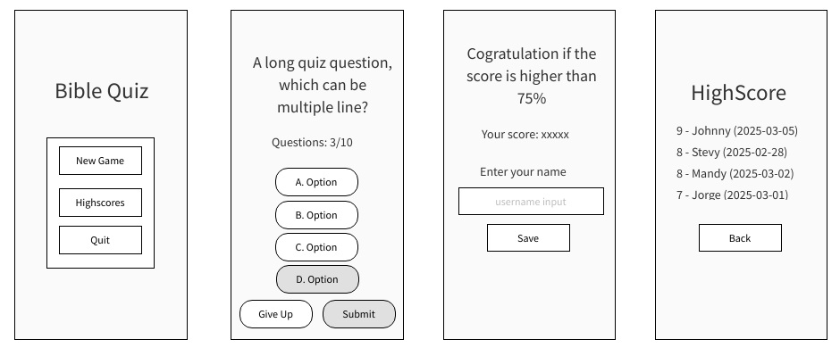
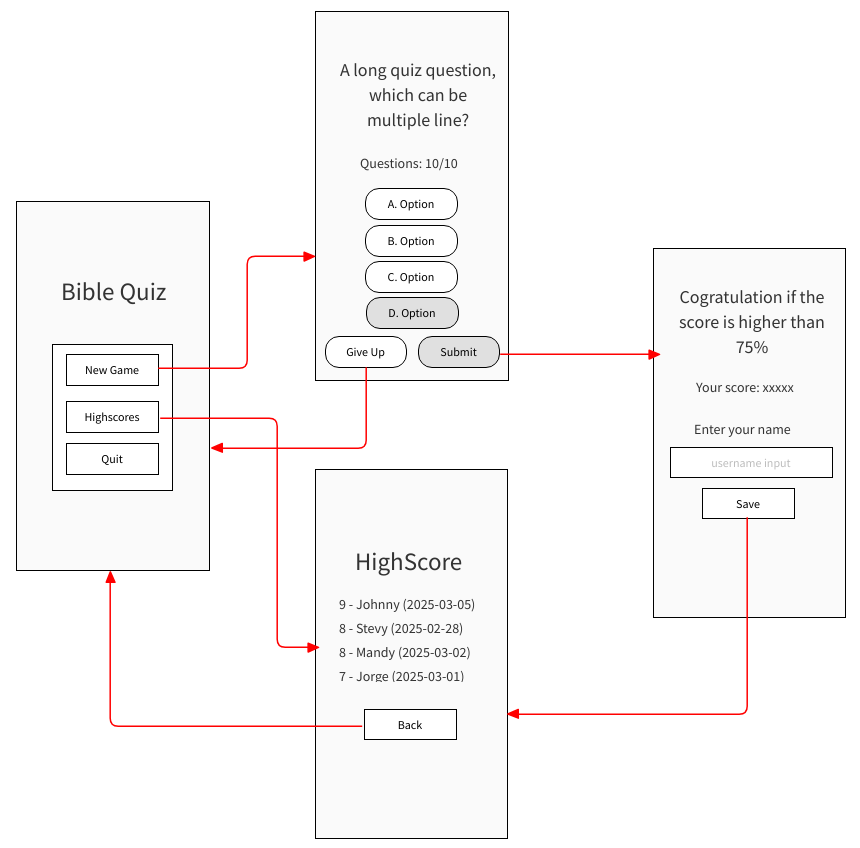
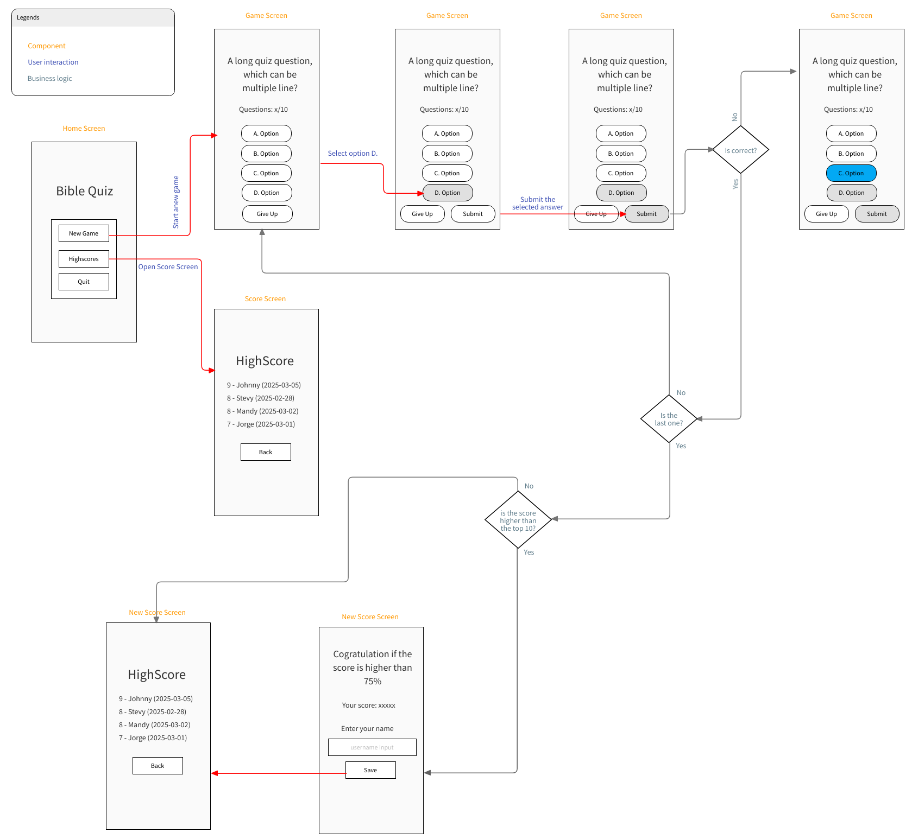
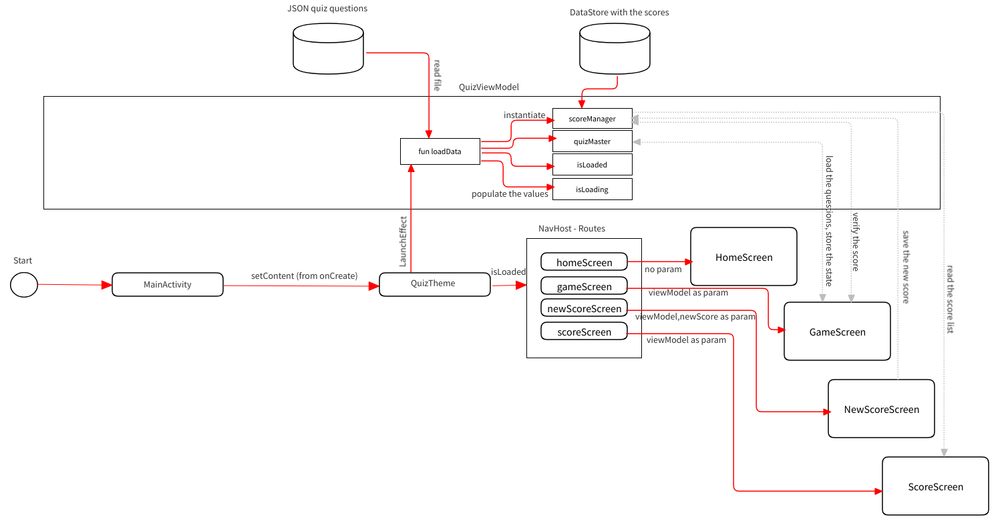

# Quiz2

## Why

  
IU.ORG - Project PROJECT - click for details

This project was created for the DLBCSEMSE02 - Mobile Software Engineering II (Task book - 1.2 / Task 2 - Develop a quizzing app)
  
**Background:** Quizzing apps provide a simple and fun way to acquire and train factual knowledge. Typical apps of this category help you to train vocabulary, basic arithmetics, traffic rules, etc. To support learning, quizzing apps provide immediate feedback on whether the given answer is correct, hints or explanations on the question at hand, or incentives such as high scores, badges, or different training levels you can reach. Furthermore, quizzing apps can include various question formats: e.g. multiple/single choice questions, assignment tasks, and sorting tasks.

**Task**: Develop a quizzing app for a subject domain of your choice. Before starting the project, create a brief concept describing the quizzing app you will develop and the functions that the app will offer. Aspects that should be covered are feedback, assessment strategy (scoring), and the app's general training rules (e.g. repeat wrong questions, provide training levels). The app must meet the following criteria at a minimum:
- The app presents interactive quizzing questions.
- The app evaluates the user's answers and provides feedback.
- The app implements an assessment and training strategy such as assigning points to correct answers, repeating wrong answers and keeping track of a high score. 
- The app implements several Android activities.
- The app is tested using unit tests.
- The app is easy to use and follows the material design and Android app quality guidelines (Google Developers, 2022).
- The source code documentation is appropriate.
- All code, resources, and configuration files required to test, build, and deploy the Android app must be uploaded to a GitHub repository. The link to the GitHub repository must be included in the project report.

The project documentation presents the initial app design using wireframes (t2informatik, 2022). Also, provide an overview of the app's software design describing the components of the app and how they interact with each other. Illustrate how you have implemented the core functions of your app by choosing relevant extracts of the source code and explaining them in more detail. You could address the navigation between screens, handling of user interactions, setting up suitable data structures, and – if applicable –access to other apps, external services, or data sources. After finishing the app, evaluate critically whether the app fulfils the targeted functionality and how you could improve the app in the future. Finally, add lessons learned from the project.

## Which?
Used technologies:
- latest Android Studio with 2024.2.2 patch
- Kotlin
- JetPack Compose
- Compose navigation, Gson, DataStore etc

**Note:** Choosing the right tools was a bit challenging because, on one hand, I learned and had experience with Java and XML, and on the other hand, after I did an investigation, most of the recommendations were near Kotlin and jetPack Compose, so I chose this option because I like challenges.

## What?
- as user:
    - questions with 4 answer options, each correct answer would be 1 score, until player reach the last question
    - scoreboard with the top 10 score
    - special text if the current score is above than 75%
    - the screen orientation change should not have any negative effect to the current game (not reset the questions etc)
- as developer:
    - at least 1 activity (MainActivity)
    - 4 screen
        - Home/Initial screen with start new game/score list/quit menu
        - Game screen which will show the questions with the selectable options
        - High score screen where the user can type his/her name, in case it is eligible for the top 10
        - Score screen, leadboard where the top 10 score listed together with the date and name
    - 1 view model which load the data only 1x in app life cycle
    - business logic should be separate as much it is possible from the UI components
    - JSON file with the questions
    - DataStore, for persist the scores
    - tests with JUnit 5

## How
### Wireframe

### Navigation (good score)

### More in depth view

### Data Flow in the app

## Code
### Main elements
- [MainActivity](https://github.com/shadowvzs/quiz2/blob/master/app/src/main/java/com/example/quiz/MainActivity.kt) - entry point of the application, handle the NavControllerHost too
### Business logic
- [QuizViewModel](https://github.com/shadowvzs/quiz2/blob/master/app/src/main/java/com/example/quiz/viewModels/QuizViewModel.kt) - view model life cycle is independent from the activity life cycle (singleton), so ideal for store the loaded data, instatiate the managers
- [QuizMaster](https://github.com/shadowvzs/quiz2/blob/master/app/src/main/java/com/example/quiz/services/QuizMaster.kt) - manage the current question (select the current question, verify the answer, track how many failed or not etc)
- [ScoreManager](https://github.com/shadowvzs/quiz2/blob/master/app/src/main/java/com/example/quiz/services/ScoreManager.kt) - load/update the score in dataStore
### UI components
- [Screens](https://github.com/shadowvzs/quiz2/tree/master/app/src/main/java/com/example/quiz/screens) - composable view screens (HomeScreen, ScoreScreen, NewScoreScreen, GameScreen)
### Data models
- [BaseQuizItam](https://github.com/shadowvzs/quiz2/blob/master/app/src/main/java/com/example/quiz/models/BaseQuizItem.kt) - data class for the questions
- [ScoreHistory](https://github.com/shadowvzs/quiz2/blob/master/app/src/main/java/com/example/quiz/models/ScoreHistory.kt) - data class for a record (score, date, name)
### Helpers
- [JSON](https://github.com/shadowvzs/quiz2/blob/master/app/src/main/java/com/example/quiz/utils/JSON.kt) - helper method to load json file from the assets folder
- [Routes](https://github.com/shadowvzs/quiz2/blob/master/app/src/main/java/com/example/quiz/Routes.kt) - contains an object which we will use as an enum, to prevent the miss typing in the navigate method

## Conclusion
Youtube [video](https://youtu.be/6_nGAE2g-XI), click below

### Target
- The app fulfills the targeted functionalities, in the simplest way.
### Future improvement
- There is some room for the improvement like:
   - adding DI (dependency injection)
   - more predefined/standard font size, colors etc into the ui theme
   - more tests, ex. for score saving
   - if this is a real project then **CHANGE.LOG** for documenting all changes
   - implementing more funny icons and trophy too for the scoreboard
### Lesson Learned
 Development with compose is a unique approach, which has good potential, similar to ReactJS (using an object for modeling, function components - compose functions, local state, life cycle hooks like useEffect - launchEffect, etc), but also needs some experience to master it, but worth it (at least ReactJS a rock solid frontend framework, many companies use it). The whole project gave a good insight into the android development.

